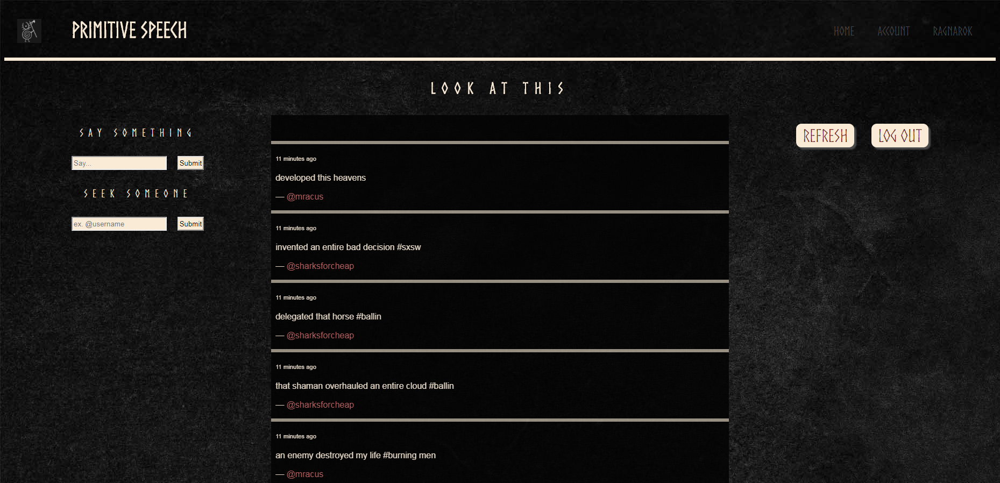

 
A recently discovered form of communication used by the Norse men of old. Eerily reminiscent of Twitter.

Check it out here: https://balintataw.github.io/primitive-speech/

Future plans : 
    <FIXED>Fix 'Go Back' button functionality to re add filtered tweets rather than refresh the page
    <FIXED>After user tweet is added, select user by click breaks. It still works by search.
    <ISSUE>There is a 1 second delay in time stamp loading. 
    <ISSUE>users username cannot be selected to show feed of only users tweets by name click, only by name search.